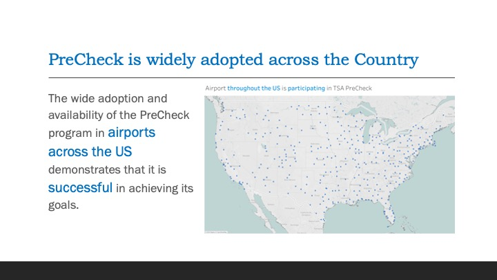
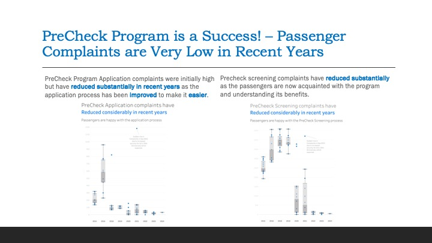
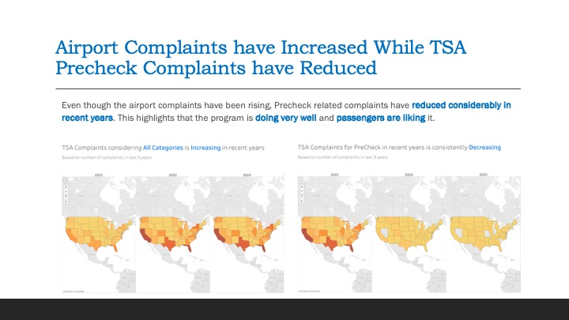
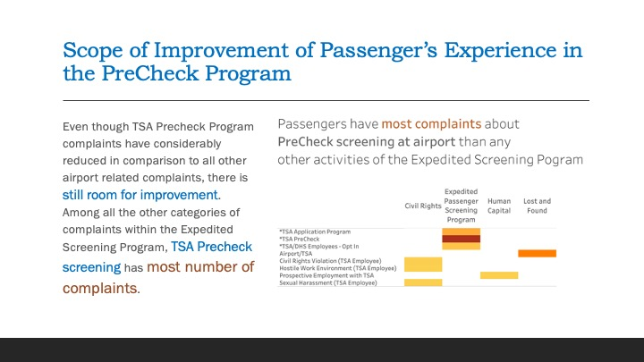

# Storytelling about TSA Precheck Program Performance using Explanatory Analysis of TSA Complaints Data

Expedited Screening Program known as PreCheck was implemented in 2015 by TSA to improve the aviation security and better experience for travelers. The program has been widely adopted by about 200 airports across the country and millions of passengers since its inception which demonstrates the program’s success in meeting its goals. The purpose of this presentation is to highlight the success of the program to the Project Team and decision makers; and at the same time inform that there is scope to further improve passengers’ experience. 

### Datasets

In its FOIA Electronic Reading Room, the US Transportation Security Administration (TSA) publishes semi-regular reports on the monthly numbers of traveler complaints by airport, category, and subcategory. These data only as PDFs (example here), rather than as machine-readable data files, and at unpredictable intervals. However, a cleaned and formatted version of this data is maintained by Data [Liberation Project][1] and volunteers TSA Complaint Counts (n.d.).

[1]:https://www.data-liberation-project.org/

### Approach

Tableau is used for performing Explanatory analysis and build the visualizations. Megre and Blending of datasets were performed to join the disparate datasets and the tableau package ca be located in `.twbx` package in `datasets` directory.

### Visualizations Design

The visualizations are built following the general storytelling guidelines; introduction to the problem, adding another possibility and a call to action for resolution of the problem. Gestalt principles were used to draw attention to the specific parts of a visualizations using pre-attentive attributes like color, text and white spaces.

_White Spaces_
White spaces were used strategically to make the charts more aesthetic and reduce clutter. There is sufficient white spaces left in the charts so that it doesn’t appear overwhelming to the audience. Gap is kept between the Title and the plot so that there is natural attention to the title before audience starts looking at the actual chart.

_Color_
Color was sparingly used to draw attention to the message that needs to be conveyed. Shades of Gray were used to mute unimportant information and push those to background. While Blue and Black were used for highlighting the main idea or drawing attention to particular area/information.

_Text_
Chart titles were colored black with larger font size to convey the main idea with highlighting main words in blue. Axis titles were hidden wherever unnecessary to keep less information and reduce clutter. Axis titles were colored light Gray to push it in background and have audience focus on Black and Blue texts. Chart borders were hidden to make the actual plot more prominent and reduce any distraction. Chart titles and texts are left aligned for aesthetic and match the natural (zig-zag) order of English reading habits.

_Plots_
Maps with a light background was used so that audience are not distracted by the actual map or its boundaries, rather they can focus on the colored areas on map which is conveying the main message. A darker shade of gray was used to make the plot stand out from the lighter gray colored axis and labels. Extensive outliers are labelled in the Box plots to inform the audience that these points are just unusual and not expected to happen regularly, so that they are not confused with these outlier points. 

### Major Visualizations

### Ethical Considerations

The data doesn’t contain any confidential information and is publicly available, so there is no risk of data privacy concerns (TSA Complaint Counts, n.d.). The measures used for the maps are total counts of complaints and average complaints. Both of these measures can get skewed based on presence of outliers. Missing complaints data for any date was assumed to be because of no complaints made on that date for an airport, which may not be a true assumption in some cases and data may be missing for errors in data collection. The outcome and recommendation of the study must be used with this knowledge of assumptions.

### References

TSA Complaint Counts (n.d.). Github. **https://github.com/data-liberation-project/tsa-complaint-counts/tree/main**

